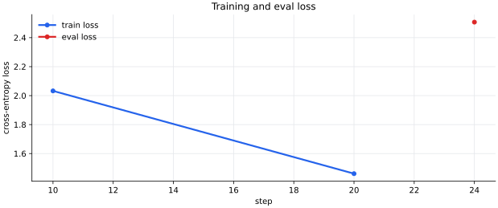
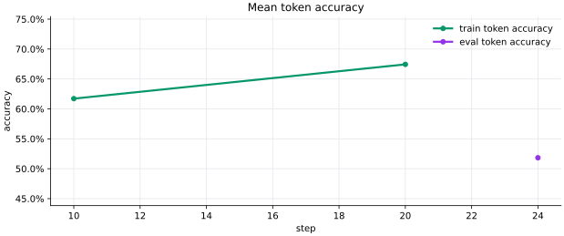
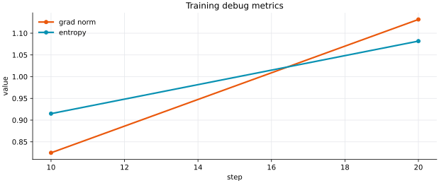
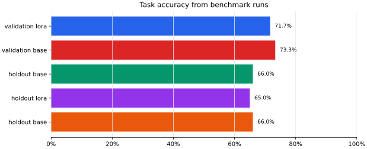
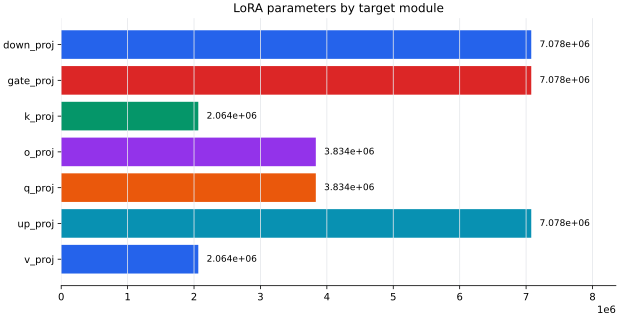
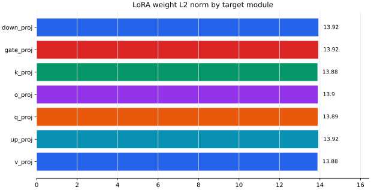
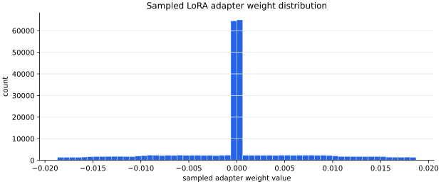

# LoRA training diagnostics

## Inputs

- Checkpoint: `checkpoints/lora_public_v2_B`
- Merged model: `checkpoints/merged_lora_public_v2_B`
- Benchmark summary: `results/lora_bench_v2/benchmark_summary.csv`
- Train/dev/holdout data: `data/sft_lora_public_v2/train.jsonl`, `data/sft_lora_public_v2/dev.jsonl`, `data/sft_lora_public_v2/holdout.jsonl`

## Training setup

- Base model: `Qwen/Qwen3-4B-Thinking-2507`
- Architecture: `Qwen3ForCausalLM`
- LoRA rank/alpha/dropout: `16` / `32` / `0.05`
- Target modules: `k_proj, up_proj, gate_proj, v_proj, o_proj, q_proj, down_proj`
- Trainable adapter params found: `33,030,144`
- Attention LoRA params: `11,796,480`
- MLP/feed-forward LoRA params: `21,233,664`

## Loss function

The training script uses `SFTTrainer` for causal language modeling, so the objective is next-token cross-entropy over the flattened `text` field.
In this run, `assistant_only_loss` is `False (inferred from this train script's defaults)`, `packing` is `False (inferred from this train script's defaults)`, and `max_length` is `4096 (inferred from this train script's defaults)`.
That means the logged loss is token loss, not exact-answer accuracy.

## Curves

- Last train loss: `1.4613072` at step `20`
- Last train token accuracy: `67.44%`
- Eval loss: `2.5072443` at step `24`
- Eval token accuracy: `51.83%`

## Task accuracy

| Split | Base | LoRA | Delta | Notes |
|---|---:|---:|---:|---|
| Training task accuracy | not measured | not measured |  | No generated train-set predictions were found; only token accuracy is logged. |
| Validation/dev task accuracy | 73.33% | 71.67% | -1.67 pts | Public dev split. |
| Holdout free-response task accuracy | 66.00% | 65.00% | -1.00 pts | Free-response holdout split. |

## Weight diagnostics

## Why this LoRA probably did not help

- The SFT train split has only `371` examples and the run reached only `24` optimizer steps.
- Eval was logged at `eval_steps=50` while training logged at `logging_steps=10` and stopped at `max_steps=24`. This gives only one validation-loss point, so it is hard to apply the TA's loss-intersection rule.
- The train loss was still decreasing at the end, so the run was undertrained; at the same time, validation/holdout task accuracy got worse, which suggests the LR/capacity/data mix was not stable enough to improve reasoning.
- Train token accuracy reached `67.44%`, while eval token accuracy was `51.83%`; that is a clear generalization gap.
- The LoRA improved free-response dev accuracy from `66.67%` to `68.69%`, but hurt MCQ dev accuracy from `81.48%` to `75.31%`.
- Holdout free-response accuracy moved from `66.00%` to `65.00%`, so the small dev free-response gain did not generalize.
- The loss was computed on flattened chat text, so some training signal went into reproducing prompt/template tokens instead of only supervising answer tokens.
- The adapter touches both attention and MLP projections; with little data, that is enough capacity to overfit answer style without improving reasoning.

## Holdout diff groups

| Group | Count |
|---|---:|
| `base_correct_lora_correct` | 63 |
| `base_correct_lora_wrong` | 3 |
| `base_wrong_lora_correct` | 2 |
| `base_wrong_lora_wrong` | 32 |

## Similar datasets to consider

Use these as candidates for augmentation, then filter/deduplicate into the exact final-answer format used by this competition.

| Dataset | Size | Why it helps | Source |
|---|---:|---|---|
| GSM8K | 8.5K grade-school math word problems | Good for concise multi-step arithmetic reasoning and final-answer extraction. | https://huggingface.co/datasets/openai/gsm8k |
| MATH | 12.5K competition problems with step-by-step solutions | Useful for harder algebra, counting, number theory, and geometry reasoning. | https://arxiv.org/abs/2103.03874 |
| DeepMind Mathematics Dataset | Generator plus pre-generated modules | Can synthesize targeted algebra, arithmetic, calculus, comparison, and probability drills. | https://github.com/google-deepmind/mathematics_dataset |
| AQuA-RAT | About 100K algebraic word problems | Multiple-choice algebra with rationales; useful for MCQ formatting and option selection. | https://huggingface.co/datasets/deepmind/aqua_rat |
| MathQA | 29,837 train / 4,475 validation / 2,985 test | AQuA-derived word problems with options, rationales, and operation programs. | https://huggingface.co/datasets/allenai/math_qa |
| NuminaMath-CoT | About 860K chain-of-thought math problems | Large CoT pool; filter heavily to match the competition answer style. | https://huggingface.co/datasets/AI-MO/NuminaMath-CoT |
| OpenMathInstruct-2 | 14M generated problem-solution pairs | Very large synthetic instruction data; best used after strict deduping and format filtering. | https://huggingface.co/datasets/nvidia/OpenMathInstruct-2 |

## Generated files

- `training_curve.csv`
- `accuracy_summary.csv`
- `inference_debug_metrics.csv`
- `dataset_summary.csv`
- `lora_parameter_summary.csv`
- `lora_weight_stats.csv`

For the next one-epoch LR/optimizer/module sweep, run `python3 scripts/plan_lora_experiments.py` and then execute selected commands from `analysis/lora_experiment_plan/README.md`.
